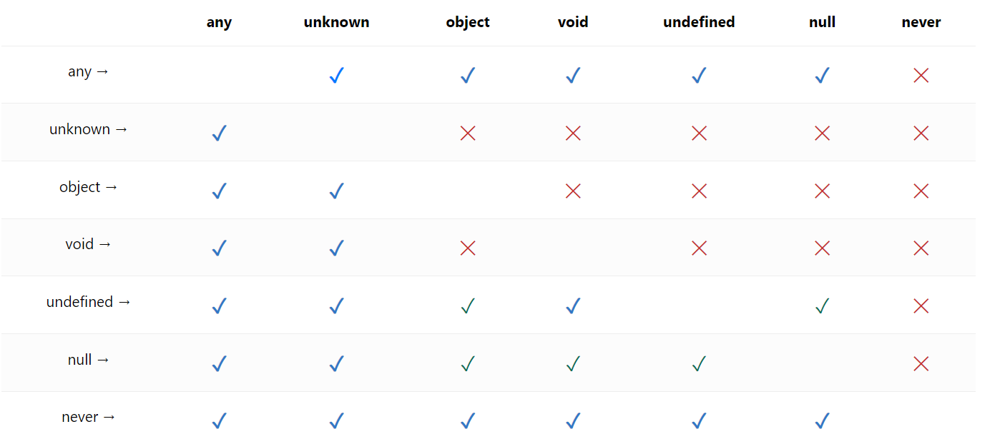

# ts-all-in-one

### 타입스크립트설치

- npm init -y
- npm i typescript
- npx tsc --init
- tsconfig.json에 아래 삽입 더 많은 기능은 공식문서 참조할것

```
{
    "compilerOptions": {
        "target": "es5",
        "module": "commonjs",
        "noImplicitAny": true,
        "strictNullChecks": true
    }
}
```

### 타입스크립트는 변수, 매개변수, 리턴값에 타입 붙이는 것!

```
const a: string = "5";
const b: number = 5
const c : boolean = true
const d : undefined = undefined;
const e : null = null
const f: any = true

/* function add(x: number, y: number): number { return x + y }
const add: (x: number, y: number) => number = (x, y) => x + y;
const obj: { lat: number, lon: number } = { lat: 37.5, lon: 127.5 }; */

const arr : string[] = ['12','45']
const arr2 : number[] = [123,456]
const arr3 : [number,number,string] =[1,2,'33']

const obj :{lat:number,lon:number} = {lat:12,lon:2}
```

### 타입추론을 정확하게 활용할것

```
function add(x:number,y:number):number {return x+y}
const result = add(1,5)
```

result 의 타입을 지정안해도 number라는것을 추론해준다

### js 변환 시 사라지는 부분을 파악

```
function add(x:number,y:number):number;
function add(x,y){
    return x+y
}
```

- 위 처럼 함수 타입만 설정하고 밑에 함수를 선언해도 위에 타입함수는 타입지정처리가 된다.

```
aa = 'hello' as unknown as number
```

### never 타입과 느낌표(non-null assertion)

- never 관련 자료
- https://ui.toast.com/weekly-pick/ko_20220323

### 템플릿리터럴타입

```
type World = "world" | "hell";

// type Greeting = "hello world"
type Greeting = `hello ${World}`;
```

### enum값을 대체하는 as const

```
const enum EDirection {
    Up,
    Down,
    Left,
    Right,
  }

const ODirection = {
    Up: 0,
    Down: 1,
    Left: 2,
    Right: 3,
  } as const;

  const a = ODirection.Up
```

### union intersection

const aa: A | B = { a: 'hello', b: 'world' }; // 여러개중에 하나만 있으면 된다.
const bb: A & B = { a: 'hello', b: 'world' }; // 모든 속성이 다 있어야함.

### 타입 상속과 네이밍규칙

```
type Animal = {breath:true}
type 포유류 = Animal&{breed:true}
type Human = 포유류&{think:true}

const zeroCho :Human = {breath:true,breed:true,think:true}
```

// 네이밍룰 ? type interface
// interface에는 I type에는 T enum에는 E 붙이는 방법이 있음
// 요즘에는 안붙이는게 국룰임(마우스 올리면 다 나옴, 그리고 interface 나눠서 굳이 이득이 없음)
// 근데 나는 개인적으로 붙임 그래야 가독성이 더 좋은것같음

### 좁은 타입, 넓은 타입

```
type A = string | number; //넓은타입
type B = string; // 좁은타입
type C  = string & number; // 공집합

type ObjA = {name:string}//넓은타입
type ObjB = {age:number}// 넓은타입
type ObjC = {name:string,age:number}//좁은타입
type ObjAB = A|B
```

// 객체는 상세할수록 좁은타입
// any는 합집합 never는 공집합이라고 생각하면된다.

### any unknown 대입표



### Object 와 {} 타입

```
const x: {} = "hello";
const y: Object = "hi"; //대문자 Object와 {} 는 모든타입 (null과 undefined 제외)

//unknown = {} | null | undefined
```

### 인덱스드 시그니처

```
interface A {
  a: string;
  b: string;
  c: string;
}

interface A {
  [key: string]: string;
} //인덱스 시그니처
```

### implements 와 public private protected

```
interface AZ {
  a: string;
  b: string;
}

class B implements AZ {
  private a = "12";
  protected b = "11";
}


```

- interface 에 implements 는 굳이 쓸필요없지만 객체지향언어에서 추상에 의존하지말고 구현에 의존해야할때는 사용
- (public) vs private vs protected
- 둘다 해당클래스 내부에서 사용이 가능함
- protected private 둘다 인스턴스에서 사용이 불가능함
- protected 는 extends로 상속받은 class에서는 사용이 가능함
